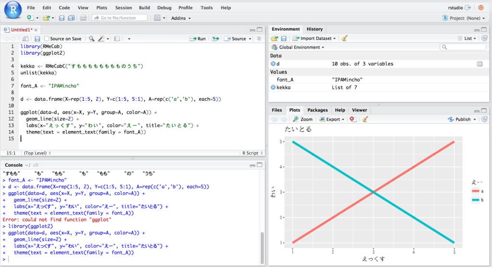
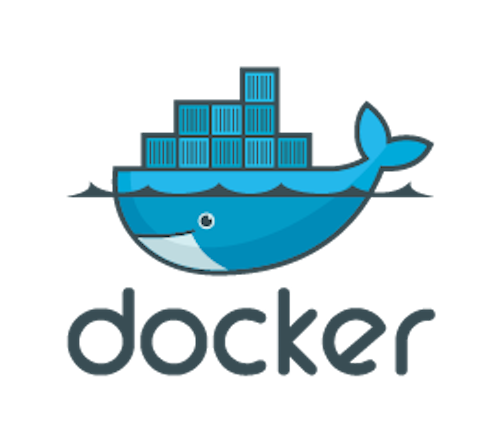

```{r eval=TRUE, echo=FALSE, warning=FALSE, message=FALSE, comment=""}
knitr::opts_chunk$set(echo = TRUE,
                      eval = TRUE,
                      warning = FALSE,
                      message = FALSE,
                      comment = "",
                      fig.height = 7,
                      fig.width = 7,
                      out.height = 400,
                      out.width = 400)
```


# はじめに
## 自己紹介
.pull-left[
- 松村優哉
- <u>Twitter</u>: **y\_\_mattu**
- <u>GitHub</u>: **ymattu**
- M1
- 計量経済学、ベイズ統計、因果推論、マーケティング
- 言語: R, SAS, Python
- https://ymattu.github.io/
- http://y-mattu.hatenablog.com/

]

.pull-right[

]
---

---
# はじめに
## 今日のお話
- RStudio Server について
- MeCab と RMeCab について
- Docker について
- mecab-d の使い方
---

# RStudio Server について

## 用途
- リモートのサーバーに(AWS など)にインストールしてローカルから操作
- ローカルに構築(Virtualbox × Vagrant など)

##メリット
- 複数人で同一環境を共有できる
- (ローカルの場合)ローカルの環境(OS など)に依存しない
- すぐ作れてすぐ捨てられる

--

.center[通常は仮想**マシン**で構築]

---
# Docker について
- 仮想化のひとつ(コンテナを作る)
- 仮想マシンより軽量
- Dockerfile や Docker イメージ で作るので同一環境が作りやすい
- RStudio Server もインストール可能(`rocker/tidyverse`)
- 詳細はググってください。。。
- 参考: http://y-mattu.hatenablog.com/entry/2017/03/27/010048

## 今回のメイン: Docker × RStudio Server × RMeCab

---
# MeCab と {RMeCab} パッケージ
## MeCab
日本語の形態素解析器

## {RMeCab}
- MeCab を R から操作するパッケージ
- インストール

```{r eval=FALSE}
install.packages ("RMeCab", repos = "http://rmecab.jp/R")
```

---
# RMeCab パッケージの出力例
```{r }
library(RMeCab)
RMeCabC("今日は土曜日です")
```

---
# Docker イメージを作った(**`mecab-d`**)
### Docker Hub にあります
https://hub.docker.com/r/ymattu/mecab-d/

### こんなのが入ったコンテナが構築できます
- RStudio Server
- tidyverse なパッケージ群
- MeCab
- {RMeCab}パッケージ
- TeX 環境
- IPAex フォント→ ggplot2 の日本語も豆腐化しない!

---
# `mecab-d` の使い方
## イメージの取得
```{bash, eval=FALSE}
docker pull ymattu/mecab-d
```

## コンテナの作成
```{bash, eval=FALSE}
docker run -p 8787:8787 -v /Users/ymattu/Desktop:/home/rstudio -d --name mattu ymattu/mecab-d:latest
```

---
# ブラウザでアクセス!
アドレスバーに localhost:8787 と入力



---
# Enjoy!

.pull-left[

]

.pull-right[

]
